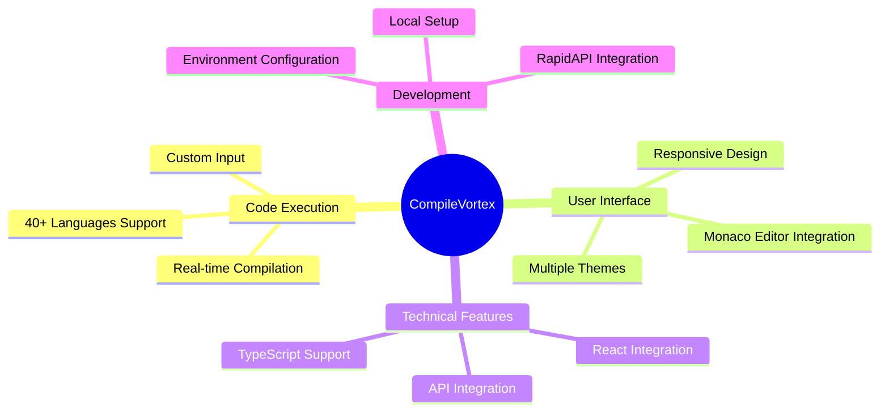

<div align="center">


<p align="center">
  <a href="#features">Features</a> •
  <a href="#demo">Demo</a> •
  <a href="#installation">Installation</a> •
  <a href="#tech-stack">Tech Stack</a>
</p>

[](LICENSE)
[](https://compile-vortex.vercel.app)
[](https://reactjs.org)
[](https://www.typescriptlang.org)

<p align="center">A powerful web-based code editor that enables you to compile and run code in over 40 programming languages. Features a customizable environment with multiple themes for an enhanced coding experience. ✨</p>

</div>

## ✨ Features

<div align="center">



</div>

## 🚀 Demo
Experience CompileVortex live at [https://compile-vortex.vercel.app](https://compile-vortex.vercel.app)

## 🛠️ Installation

1️⃣ Clone the repository:
```bash
git clone https://github.com/lohitkolluri/CompileVortex
```

2️⃣ Navigate to project directory:
```bash
cd CompileVortex
```

3️⃣ Install dependencies:
```bash
yarn # or npm install
```

4️⃣ Configure API:
- Register on [RapidAPI](https://rapidapi.com/judge0-official/api/judge0-ce/pricing)
- Create `.env` file and add API keys

5️⃣ Run development server:
```bash
yarn start # or npm start
```

6️⃣ Open in browser:
- Visit [http://localhost:3000](http://localhost:3000)

## 💻 Tech Stack

<table align="center">
  <tr>
    <td align="center" width="96">
      
      <br>React
    </td>
    <td align="center" width="96">
      
      <br>TypeScript
    </td>
    <td align="center" width="96">
      
      <br>Tailwind
    </td>
    <td align="center" width="96">
      
      <br>Monaco
    </td>
  </tr>
</table>

## ⚡ Core Features

- 🌐 Language Support
  - Over 40 programming languages
  - Real-time compilation
  - Custom input capabilities
- 🎨 Editor Features
  - Multiple theme options
  - Monaco Editor integration
  - Syntax highlighting
- 💻 Development
  - Easy local setup
  - RapidAPI integration
  - Environment configuration

## 📄 License

<div align="center">

MIT License © [Lohit Kolluri](LICENSE)


</div>
